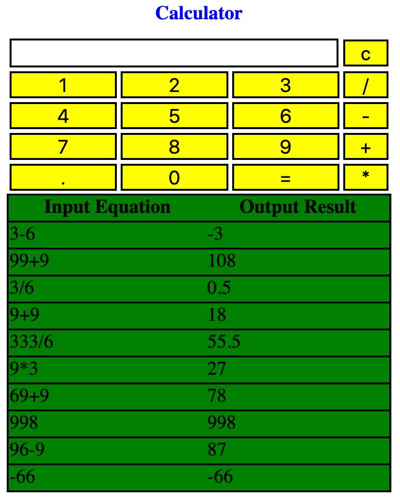

# calculator-web-app

## Installation
1. Clone this project at local
1. Install [node.js](https://nodejs.org/en/)
2. Run `npm install`

## Execution
1. Run `node server/app.js`
2. Open [ui/calculator.html](ui/calculator.html)

## Screenshot
